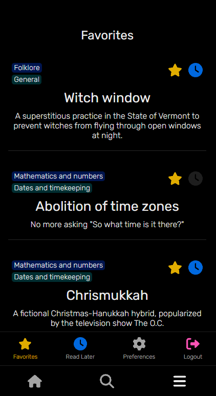

# Aimless


Aimless consolidates interesting and unusual articles from Wikipedia for light reading. It offers a more educational alternative to social media scrolling.

This app was created as a Front End Capstone project while attending Nashville Software School's Full Stack Web Development Bootcamp. It was completed with one week of planning and 3.5 weeks of coding.

## Table of Contents

- [Project Description](#project-description)
    - [Article Card](#article-card)
    - [Article](#article)
    - [Comments](#comments)
    - [Home](#home)
    - [Browse](#browse)
    - [Favorites](#favorites)
    - [Preferences](#preferences)
- [Technologies Used](#technologies-used)
- [Possible Future Features](#possible-future-features)
- [How to Install and Run](#how-to-install-and-run)
- [Links](#links)

## Project Description

### Article Card


An article card contains the article title, teaser text, category, subcategory, and icons for both favoriting and saving for later.

Clicking the star icon on the article card will add that article to the database as a favorite for that user, and same for the clock icon, adding it to read later.

Clicking the category or subcategory on the article card will navigate the user to the Browse page, with the search terms containing the category or subcategory that was clicked on.

Clicking the article title or teaser text will open the article.

### Article


At the Article view, the user can read the full article. This component fetches the HTML from the Wikipedia page of the same title. It does so by using the Wikipedia API.

### Comments


When viewing an article, the user can click the speech bubble icon in the top right hand corner to open the comments section. Here, the user can add, update, or delete their own comments.

### Home


At the home page the user is provided a completely random article, displayed in an article card. Each article belongs to a subcategory, which in turn belongs to a category.  They may click "Find me a different article" to fetch another random article, or click "Keep category" to only fetch a new subcategory and article, or click "Keep subcategory" to only fetch a new article, keeping the category and subcategory.

### Browse


At the Browse page, the user can browse all articles (fetched 20 at a time with pagination) or search/filter to find specific ones.

### Favorites



The Favorites page is where the user may view the articles they've favorited. The same applies for the Read Later page.

### Preferences


At the Preferences page, the user can toggle the "Family-friendly homepage" option. When on, it prevents any vulgar or strong articles from appearing on the home page. The terms it avoids are located in the NSFW.js file.

The user can also activate light mode, which is shown in the screenshot below.


## Technologies Used

<a href="https://reactjs.org/" title="React JS"></a>
<a href="https://reactrouter.com/en/main" title="React Router"></a>
<a href="https://developer.mozilla.org/en-US/docs/Web/JavaScript" title="JavaScript"></a>
<a href="https://www.npmjs.com/" title="npm"></a>

## Possible Future Features

- Making Aimless a full stack, deployed application.
- Adding an option in Preferences that allows the user to customize which articles are shown on the home page, by letting them select categories and subcategories they're more interested in, and also select ones they're less interested in.

## How to Install and Run

1. git clone this repo to your local machine.

2. Make sure that Node.js and npm are installed on your machine. <a href="https://docs.npmjs.com/downloading-and-installing-node-js-and-npm">Click here for installation.</a>
3. Run the following commands in the terminal:

```
npm i
npm i json-server -g
```

4. Setup is complete! Use the following commands to run Aimless locally. These commands may have to be run in separate terminal windows.

```
json-server src/data/exampleDB.json -p 8088 -w
npm start
```

5. Enjoy the App!

## Links

<a href="https://dbdiagram.io/d/637d6d26c9abfc6111749565" target="_blank">Project ERD</a>